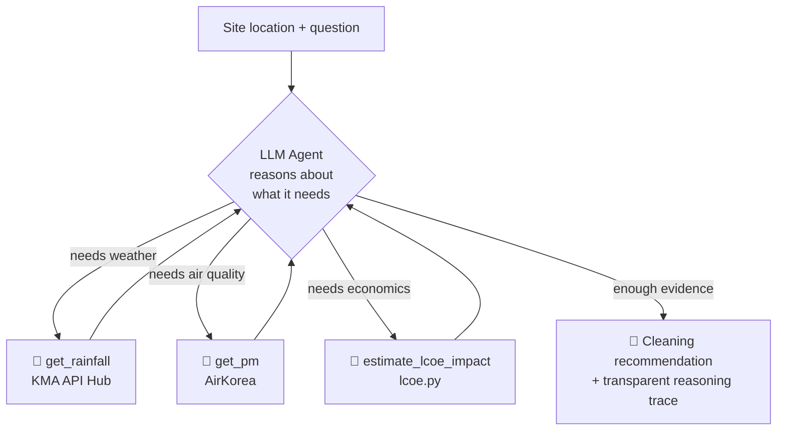

# Solar Soiling Check — an IEA-grounded analysis agent

**How much does soiling cost a solar site in a given region?** This is a small tool that estimates that loss — and judges it against the **IEA PVPS Task 13 (T13-21:2022)** framework rather than guesswork.

> Built by a one-person company as an honest demonstration of **operating an AI agent as a team member**: not a polished product, but a record of an agent being designed, reasoned about, and put to work.

---

## Why this repo exists

Dust and soiling quietly drain output from solar panels, but most owners never quantify it. The loss is invisible until it's large. This tool makes it visible for **a specific location you care about**: feed it a site, and it works out how much that region's air quality and rainfall history imply for soiling loss.

The point isn't a finished product — it's the *reasoning*. I bring 25 years in Korea's power industry but only a few years of coding, and I close that gap by giving an AI agent a **defined role on the team**: the analyst. This repo is the artifact of that approach.

Context over completeness. The rough edges are intentional.

---

## What it does

The agent answers one question for a location of interest:

> **"How much is this site losing to soiling — and is it bad enough to act on?"**

It works the problem the way an analyst would:

1. **Gather** the region's air-quality (PM10/PM2.5) and rainfall history for the site.
2. **Estimate** the soiling loss as a percentage of generation, grounded in the IEA framework.
3. **Translate** that loss into lost revenue and LCOE impact.
4. **Judge** whether the loss warrants action — and show its reasoning step by step.

---

## The agent, designed as a team member

The first version of this agent was a fixed-order pipeline: fetch → compute → format. No judgment. That was the critical gap — it wasn't an agent, it was a script wearing a costume.

The real agent does the **analyst's job**: it decides what to look at, in what order, and why, using tool calls to reach for data when its reasoning requires it. The LLM is the orchestrator *and* the domain reasoner, not just a report formatter.

### Reasoning loop



### What you see when it runs

The Streamlit UI renders the agent's full trace, so a reviewer can audit *how* it decided, not just *what* it decided:

- 💭 **reasoning steps** — the agent thinking through the problem
- 🔧 **tool calls** — each data fetch / computation, with inputs and outputs
- 📝 **final recommendation** — the cleaning decision and its economic justification

This transparency is the point. An agent you can't inspect can't be a trustworthy team member.

---

## The soiling model — where domain knowledge meets the agent

Soiling is modeled as a two-term additive structure:

```
Soiling Loss (%) = PM_based_loss + Regional_characteristic
```

| Term | What it is | Where it comes from |
|------|-----------|---------------------|
| **PM_based_loss** | Baseline loss driven by particulate matter accumulation, attenuated by rainfall (a natural cleaning event) | PM10/PM2.5 (AirKorea) + rainfall (KMA), with different aggregation logic — PM is a *state* quantity averaged over time, rainfall is a *flow* quantity summed over time |
| **Regional_characteristic** | The agent's **judgment layer** — a site-specific adjustment for soiling that PM data alone cannot capture | Derived by the agent from historical PM + rainfall patterns, **grounded in IEA PVPS Task 13 (T13-21:2022)** rather than personal opinion |

### Why two terms, and why grounded in IEA

The decision to ground judgments in IEA authority rather than my own 25 years of intuition is deliberate: in front of investors and customers, *"IEA PVPS reports it"* outweighs *"I think so"* — even when I'm right.

The IEA PVPS T13-21:2022 evidence base supports the second term directly:

- **PM-only models systematically underestimate soiling.** Real soiling sources extend well beyond particulate matter — agricultural dust, pollen, bird droppings, industrial / brake / diesel particulates.
- **Soiling varies 2–3× within a single site**, depending on wind direction and the spatial distribution of nearby sources.
- IEA's macro soiling models incorporate land use, NDVI, agricultural activity, and soil type (e.g. `SR = a + b·PM10 + c·WS + d·RH`).
- The **Burgdorf case study** (~10% loss in a humid region) demonstrates how badly a PM-only assumption can miss.

So `Regional_characteristic` is exactly the kind of contextual, evidence-anchored reasoning a human analyst would add — and exactly what the agent is being designed to do.

---

## Repository structure

```
cleaning-agent-demo/
├── core/
│   ├── agent_llm.py       # LLM agent: Anthropic tool-use loop + structured reasoning trace
│   ├── lcoe.py            # LCOE / economic-impact simulator (verified port of the TS original)
│   ├── kma_weather.py     # KMA API Hub surface-observation fetcher (rainfall; lat/lon direct)
│   └── gk2a_aerosol.py    # GK2A satellite AOD extractor (built; excluded from this demo)
├── app.py                 # Streamlit UI — renders the agent trace (💭 / 🔧 / 📝)
└── README.md
```

**On `lcoe.py`:** this is a Python port of the LCOE engine from VigilAI's live React portal, confirmed to produce *numerically identical* output to the TypeScript original using KEEI 2024-22 defaults (1MW ground-mounted system). The soiling loss the agent estimates feeds directly into this model as the `pollutionLoss` input, turning a physical loss into a financial one — the number an owner actually cares about.

---

## Tech stack

| Layer | Choice |
|-------|--------|
| Language | Python (unified backend for the demo) |
| Agent / LLM | Anthropic Claude API (tool use) |
| UI / deploy | Streamlit Community Cloud |
| Air-quality data | AirKorea 최종확정 측정자료 (final confirmed PM10/PM2.5, 2001–) |
| Weather data | KMA API Hub (surface observations, rainfall) |
| Reference framework | IEA PVPS Task 13, T13-21:2022 |

---

## Status & honesty

**Working today**
- LLM agent with tool-use loop and a transparent, auditable reasoning trace
- LCOE / economic-impact engine (numerically verified against the production TS version)
- KMA rainfall fetcher (coordinate-based, no grid conversion)

**In progress**
- AirKorea nearest-station lookup by coordinates → PM10/PM2.5
- Geocoding (place name / map click → lat/lon)
- Soiling-accumulation model connecting the PM and rainfall streams
- `Regional_characteristic` analysis layer, fully grounded in the IEA framework

This is a **demo, not a product**. It is intentionally separate from VigilAI's production infrastructure (React/TypeScript portal on AWS S3/CloudFront, ap-northeast-2).

---

## How AI agents actually function as my team

Because the "agents as team members" question is the whole point, here is the honest org chart of a one-person company:

- **Claude Code → my engineer.** Writes and refactors modules in small, isolated folders to keep context clean.
- **The runtime agent (`agent_llm.py`) → my analyst.** Reasons over field data and produces the cleaning decision with a defensible justification.
- **Me → the founder.** Domain framing, problem definition, IEA grounding, and verification (e.g. checking the LCOE port output matches the baseline exactly).

These agents improve through prompt tuning and golden-dataset regression testing — not retraining. (The underlying ML models for anomaly detection and thermal grading are separate systems, with separate metrics and their own retraining cycles.)

---

## About

**강성종 / Sung Jong Kang** — Founder, VigilAI

25+ years in Korea's power sector (KEPCO 1999 → Korea East-West Power 2000–present), including operations and asset management of **38MW of solar across 9 sites** at the Dangjin power complex. First-generation operator of Korea's competitive electricity market (CBP). MBA, Warwick Business School (UK). Big Data Analysis Engineer (Korea Data Agency, 2025). Selected for an EWP internal venture and Korea's Pre-Startup Package (예비창업패키지, 2026).

I saw the structural problem from inside: solar owners rarely know how much they're losing, because the data sits with installers and O&M contractors. This tool is one small step toward making that loss measurable for any site.

🔗 LinkedIn: *[https://www.linkedin.com/in/sungjongkang/]*
🔗 VigilAI: *[vigilai.co.kr]*
