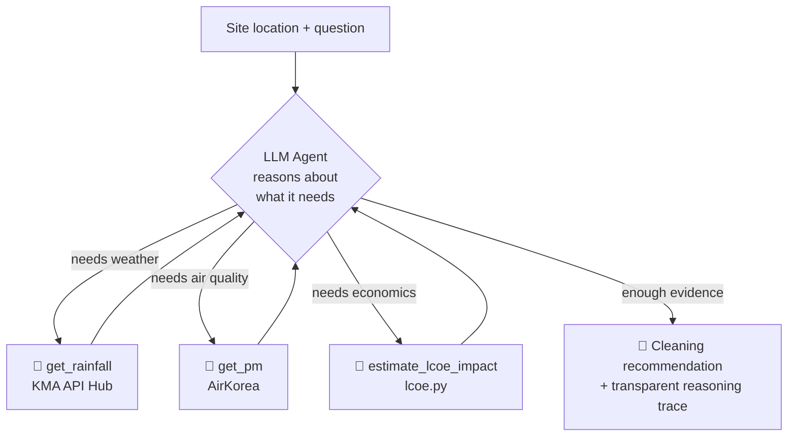

# Solar Soiling Check — an IEA-grounded analysis agent

**How much does soiling cost a solar site in a given region?** This is a small tool that estimates that loss — and judges it against the **IEA PVPS Task 13 (T13-21:2022)** framework rather than guesswork.

> Built by a one-person company as an honest demonstration of **operating an AI agent as a team member**: not a polished product, but a record of an agent being designed, reasoned about, and put to work.

---

## Why this repo exists

Dust and soiling quietly drain output from solar panels, but most owners never quantify it. The loss is invisible until it's large. This tool makes it visible for **a specific location you care about**: feed it a site, and it works out how much that region's air quality and rainfall history imply for soiling loss.

The point isn't a finished product — it's the *reasoning*. I bring 25 years in Korea's power industry but only a few years of coding, and I close that gap by giving an AI agent a **defined role on the team**: the analyst. This repo is the artifact of that approach.

Context over completeness. The rough edges are intentional.

---

## What it does

The agent answers one question for a location of interest:

> **"How much is this site losing to soiling — and is it bad enough to act on?"**

It works the problem the way an analyst would:

1. **Gather** the region's air-quality (PM10/PM2.5) and rainfall history for the site.
2. **Estimate** the soiling loss as a percentage of generation, grounded in the IEA framework.
3. **Translate** that loss into lost revenue and LCOE impact.
4. **Judge** whether the loss warrants action — and show its reasoning step by step.

---

## The agent, designed as a team member

The first version of this agent was a fixed-order pipeline: fetch → compute → format. No judgment. That was the critical gap — it wasn't an agent, it was a script wearing a costume.

The real agent does the **analyst's job**: it decides what to look at, in what order, and why, using tool calls to reach for data when its reasoning requires it. The LLM is the orchestrator *and* the domain reasoner, not just a report formatter.

### Reasoning loop



### What you see when it runs

The Streamlit UI renders the agent's full trace, so a reviewer can audit *how* it decided, not just *what* it decided:

- 💭 **reasoning steps** — the agent thinking through the problem
- 🔧 **tool calls** — each data fetch / computation, with inputs and outputs
- 📝 **final recommendation** — the cleaning decision and its economic justification

This transparency is the point. An agent you can't inspect can't be a trustworthy team member.

---

## The soiling model — where domain knowledge meets the agent

Soiling is estimated with a **semi-physical 5-stage model**, grounded in **IEA PVPS Task 13 (T13-21:2022)** and the Coello–Boyle deposition framework — not a "PM × dry-days" guess. Dust accumulates, rain washes it off, and the optical loss saturates non-linearly with accumulated mass:

```
PM split → daily deposition → rain cleaning → accumulation → nonlinear loss
```

| Stage | What it does |
|-------|--------------|
| **1. PM split** | `PM_coarse = max(PM10 − PM2.5, 0)` — coarse and fine settle at different rates |
| **2. Deposition** | `Δm = 0.0864·cosθ·(v_f·PM2.5 + v_c·PM_coarse)·F_site`  [g/m²/day] |
| **3. Rain cleaning** | `η_rain = η_max·[1 − exp(−k_R·(R − R0))]` above an effective threshold `R0` |
| **4. Accumulation** | running dust mass with optional wind resuspension, reset by cleaning events |
| **5. Nonlinear loss** | `SL = 1 − exp(−κ·mᵞ)` — loss saturates at high dust mass (10 g/m² ≈ 34%) |

Annual loss is the (insolation-weightable) mean of daily `SL`. Two calibration constants carry the uncertainty the reports flag explicitly: a **global deposition calibration** (`DEPO_CAL`, academic velocities → Korean field soiling rates) and the **regional factor `F_site`**.

### `F_site` — the regional judgment layer

`F_site` (general = 1.0, scaled up for industrial / dry-agricultural / coastal sites) is where the agent's contextual judgment enters — the site-specific adjustment PM data alone cannot capture. It maps the sidebar's regional characteristics (agriculture, industry, roads, coast, low tilt) onto a single multiplier, and the `base` (F_site = 1) vs `total` split is preserved for audit.

The decision to ground judgments in IEA authority rather than my own 25 years of intuition is deliberate: in front of investors and customers, *"IEA PVPS reports it"* outweighs *"I think so"* — even when I'm right. The evidence base supports it directly:

- **PM-only models systematically underestimate soiling.** Real sources extend well beyond particulate matter — agricultural dust, pollen, bird droppings, industrial / brake / diesel particulates.
- **Soiling varies 2–3× within a single site**, depending on wind direction and nearby sources.
- Coarse clay / cement / ash particles adhere strongly; hygroscopic salts promote **caking** in humid / coastal sites.
- The **~10% loss in humid-region case studies** shows how badly a PM-only assumption can miss.

**Validation (Seosan, 2025 — real PM + ASOS rainfall):** general 3.4% / industrial 6.5% / heavy-pollution 9.4% — matching IEA's **3–5% world average** and **up to ~10%** for industrial / dry sites. This falls out of the physics + one deposition calibration, not curve-fitting to a target.

---

## Repository structure

```
cleaning-agent-demo/
├── core/
│   │  # Agent orchestration
│   ├── agent.py                 # Deterministic pipeline agent (non-LLM path)
│   ├── agent_llm.py             # LLM agent: Anthropic tool-use loop + reasoning trace
│   │  # Soiling model (active)
│   ├── soiling_semiphysical.py  # Semi-physical 5-stage model (IEA T13 / Coello–Boyle) + F_site
│   ├── soiling_knowledge.py     # Curated report knowledge injected into the LLM prompt
│   ├── pollution_model.py       # Runs the model → daily soiling + cleaning priorities
│   │  # Soiling model (legacy, preserved — not used by the pipeline)
│   ├── soiling_hsu.py           # pvlib HSU model (superseded by semi-physical)
│   ├── soiling_weights.py       # Old additive regional-weight heuristic
│   │  # Data ingestion
│   ├── airkorea_pm.py           # AirKorea PM10/PM2.5 (live + demo)
│   ├── pm_statistics.py         # Monthly PM Excel loader with parquet cache
│   ├── kma_weather.py           # KMA API Hub surface obs (rainfall; lat/lon direct)
│   ├── asos_rainfall.py         # ASOS hourly rainfall → nearest-station daily series
│   ├── asos_station_meta.py     # 97 ASOS station coordinates + Haversine distance
│   │  # Economics
│   └── lcoe.py                  # LCOE / economic-impact simulator (verified TS port)
├── data/
│   ├── pm_stats/                # AirKorea monthly PM Excel (2023–2025)
│   └── raw_asos/                # ASOS hourly observation CSVs (cp949)
├── app_streamlit.py            # Streamlit UI — renders the agent trace (💭 / 🔧 / 📝)
├── app_fastapi.py              # FastAPI entrypoint (alternate surface)
├── soiling_effect_4reports_model.py  # Reference implementation of the 5-stage model (from the 4-report summary)
├── requirements.txt
├── CHANGELOG.md                # Change history (see for the model-swap record)
└── README.md
```

**On `lcoe.py`:** this is a Python port of the LCOE engine from VigilAI's live React portal, confirmed to produce *numerically identical* output to the TypeScript original using KEEI 2024-22 defaults (1MW ground-mounted system). The soiling loss the agent estimates feeds directly into this model as the `pollutionLoss` input, turning a physical loss into a financial one — the number an owner actually cares about.

---

## Tech stack

| Layer | Choice |
|-------|--------|
| Language | Python (unified backend for the demo) |
| Agent / LLM | Anthropic Claude API (tool use) |
| UI / deploy | Streamlit Community Cloud |
| Air-quality data | AirKorea 최종확정 측정자료 (final confirmed PM10/PM2.5, 2001–) |
| Weather data | KMA API Hub (surface observations, rainfall) |
| Reference framework | IEA PVPS Task 13, T13-21:2022 |

---

## Status & honesty

**Working today**
- LLM agent with tool-use loop and a transparent, auditable reasoning trace
- **Semi-physical 5-stage soiling model** (IEA T13-21:2022 / Coello–Boyle), validated at 3–5% for general sites and up to ~10% for industrial/dry sites
- **`F_site` regional layer** — sidebar characteristics → deposition multiplier, IEA-grounded
- **ASOS hourly rainfall** integration (nearest-station by Haversine) feeding the cleaning term
- LCOE / economic-impact engine (numerically verified against the production TS version)
- KMA rainfall fetcher (coordinate-based, no grid conversion)

**In progress**
- AirKorea nearest-station lookup by coordinates → PM10/PM2.5
- Geocoding (place name / map click → lat/lon)
- Field calibration of the model constants (κ, γ, v_f, v_c, R0) against reference-cell / soiling-sensor data

This is a **demo, not a product**. It is intentionally separate from VigilAI's production infrastructure (React/TypeScript portal on AWS S3/CloudFront, ap-northeast-2).

---

## How AI agents actually function as my team

Because the "agents as team members" question is the whole point, here is the honest org chart of a one-person company:

- **Claude Code → my engineer.** Writes and refactors modules in small, isolated folders to keep context clean.
- **The runtime agent (`agent_llm.py`) → my analyst.** Reasons over field data and produces the cleaning decision with a defensible justification.
- **Me → the founder.** Domain framing, problem definition, IEA grounding, and verification (e.g. checking the LCOE port output matches the baseline exactly).

These agents improve through prompt tuning and golden-dataset regression testing — not retraining. (The underlying ML models for anomaly detection and thermal grading are separate systems, with separate metrics and their own retraining cycles.)

---

## About

**강성종 / Sung Jong Kang** — Founder, VigilAI

25+ years in Korea's power sector (KEPCO 1999 → Korea East-West Power 2000–present), including operations and asset management of **38MW of solar across 9 sites** at the Dangjin power complex. First-generation operator of Korea's competitive electricity market (CBP). MBA, Warwick Business School (UK). Big Data Analysis Engineer (Korea Data Agency, 2025). Selected for an EWP internal venture and Korea's Pre-Startup Package (예비창업패키지, 2026).

I saw the structural problem from inside: solar owners rarely know how much they're losing, because the data sits with installers and O&M contractors. This tool is one small step toward making that loss measurable for any site.

🔗 LinkedIn: *[https://www.linkedin.com/in/sungjongkang/]*
🔗 VigilAI: *[vigilai.co.kr]*
